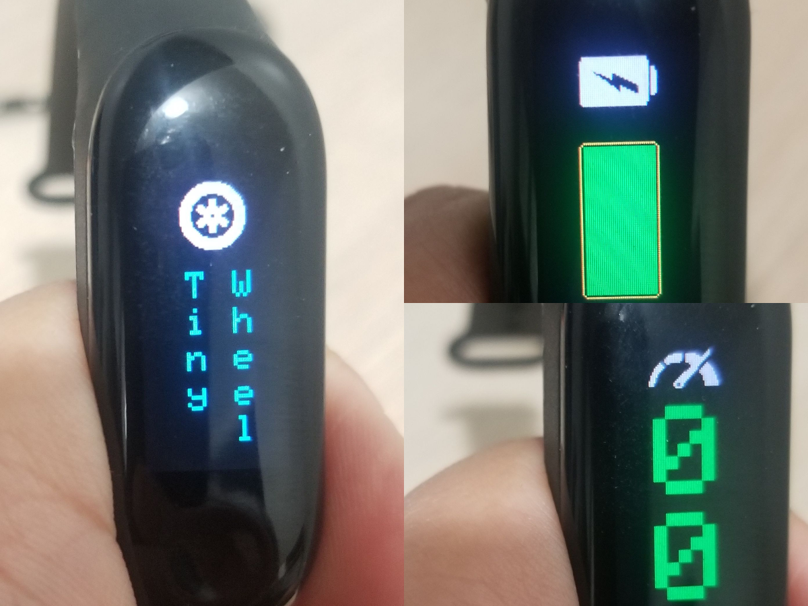

# TinyWheel


**NOTICE: THIS IS UNDER ACTIVE DEVELOPMENT, USE AT YOUR OWN RISK**



The TinyWheel allows you to check your battery, speed and some other stats from your wheel using a ESP32 device.

## Supported Devices
- [TTGO T-Wristband](https://www.aliexpress.com/item/4000527495064.html)
- [TTGO T-Display](https://www.aliexpress.com/item/33048962331.html)

## Setup

First of all, install PlatformIO with your favourite IDE (i.e. VSCode).
Follow [this](https://platformio.org/platformio-ide) instructions.

Clone the repo

```sh
git clone https://github.com/FabioBatSilva/TinyWheel.git
```

Open cloned folder with your PlatformIO IDE (in the example, with VSCode)

```shell
cd /path/to/TinyWheel

code .
```

The first step to flash the *TinyWheel* firmware is to configure your wheel.

Copy the file `.env.dist` to `.env`
```shell
cp .env.dist .env
```
And update the variable `WHEEL_DEVICE_TYPE` according to the type of wheel you have.


To validate that your instalation is correct run the following command:
```shell
platformio run

  # Environment    Status    Duration
  # -------------  --------  ------------
  # tdisplay       SUCCESS   00:00:54.047
  # twristband     SUCCESS   00:00:58.448
```

## Generate the key

Before you can flash *TinyWheel* to your device you need to generate a key for your wheel.

This key is used to unlock your wheel, without this *TinyWheel* won't be able to connect to your wheel.

**Wheel scanner**

The first step to generate the *key* is to retreive some information from your wheel.
While running on scanner mode the *TinyWheel* will look for your wheel and retreive the name, bluetooth address and the secret that you need to generate the *key*.

Run the following command to flash *TinyWheel* in scanner mode

```shell
APP=APP_SCANNER platformio run -t upload -e twristband
```

After the firmware is flashed in `APP_SCANNER` mode open the serial monitor to retreive the the following values.
`WHEEL_DEVICE_NAME`
`WHEEL_DEVICE_ADDRESS`
`WHEEL_DEVICE_API_KEY`

```shell
platformio device monitor --baud 115200

  # Found 1 wheel
  # // ...
  # WHEEL_DEVICE_NAME=ow123456
  # WHEEL_DEVICE_ADDRESS=0a:0b:0c:0d:0e:0f
  # WHEEL_DEVICE_API_KEY=XXXXXXXXXXXXXXXXXXXXXXXXXXXXXXXX
  # Done...
  # Going to sleep
```
Copy the values from your serial monitor and update `.env` accordingly.

**Wheel activation**

The last step to generate the *key* is using the activation API from FM.

Run the following command invoke the API.
```shell
python activation.py

  # // ..
  #
  # Are you sure : [y/n]y
  #
  # // ..
  #
  # WHEEL_DEVICE_TYPE    : pint
  # WHEEL_DEVICE_NAME    : ow123456
  # WHEEL_DEVICE_API_KEY : XXXXXXXXXXXXXXXXXXXXXXXXXXXXXXXX
  # WHEEL_DEVICE_KEY     : XXXXXXXXXXXXXXXXXXXXXXXXXXXXXXXXXXXXXXXX
```
- _The script is going to ask for confirmation before it send the request, make sure you have the proper values in place and enter `y`_
- _Your ip address can get blocked if you continue to invoke the api with invalid values_
- _Keep your `WHEEL_DEVICE_KEY` and other configurations in a safe place you might need then again in the future if you are flashing the firmware again_
- _This step in only required if your are using a Pint or XR with +4210 hardware. With other versions of the gemini you can compute the key but this is not yet supported here. [See](https://github.com/TomasHubelbauer/onewheel-web-bluetooth#how-does-the-unlock-flow-go)_

Now you have the *key* and you can flash the *TinyWheel* firmware to your device.
Update the `.env` file with the `WHEEL_DEVICE_KEY` you got from `activation.py`


## Flash the firmware

Now that you have a `.env` configured with `WHEEL_DEVICE_KEY` and all the other parameters you are ready to flash.

Run the following command to flash the *TinyWheel* firmware

```shell
platformio run -t upload -e twristband

  # Wrote 1035376 bytes (580781 compressed) at 0x00010000 in 14.5 seconds (effective 572.6 kbit/s)...
  # Hash of data verified.

  # Leaving...
  # Hard resetting via RTS pin...
  # ============= [SUCCESS] Took 25.74 seconds =============

  # Environment    Status    Duration
  # -------------  --------  ------------
  # tdisplay       IGNORED
  # twristband     SUCCESS   00:00:25.742
```

If everyting was sucessfull the project will compile and upload to the wristband.


## ToDo list

- [x] BLE abstraction to talk to the wheel
- [x] Display battery percentage
- [x] Display speed
- [x] Display wristband battery
- [ ] XR support
- [ ] Support for Imperial Units
- [ ] Invoke activation from TinyWheel on APP_SCANNER mode
- [ ] Display info about the current ride
- [ ] Alerts on low battery and max speed
- [ ] Turn lights on/off
- [ ] Sleep/Wake on based on motion
- [ ] Charging animation/feedback
- [ ] Move LibWheel to a separate repo
- [ ] ???
